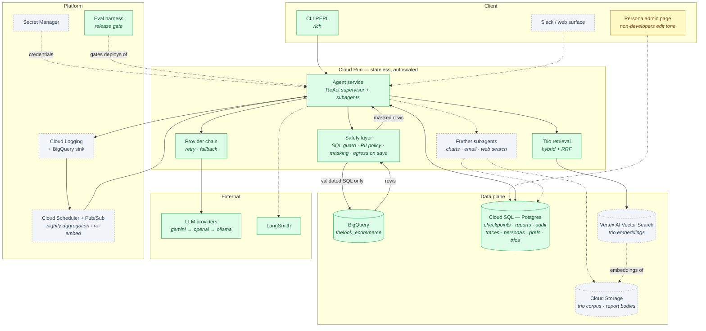
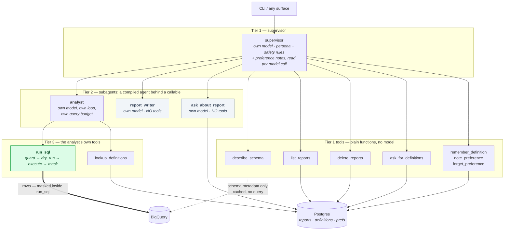
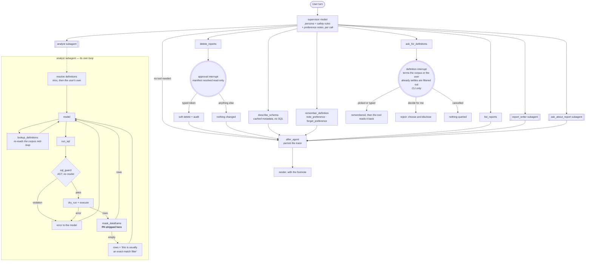
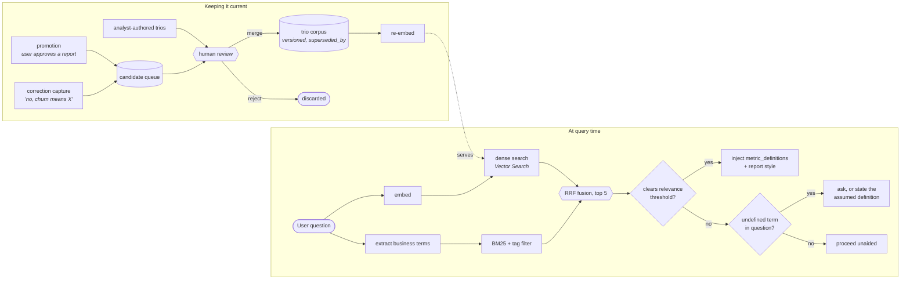
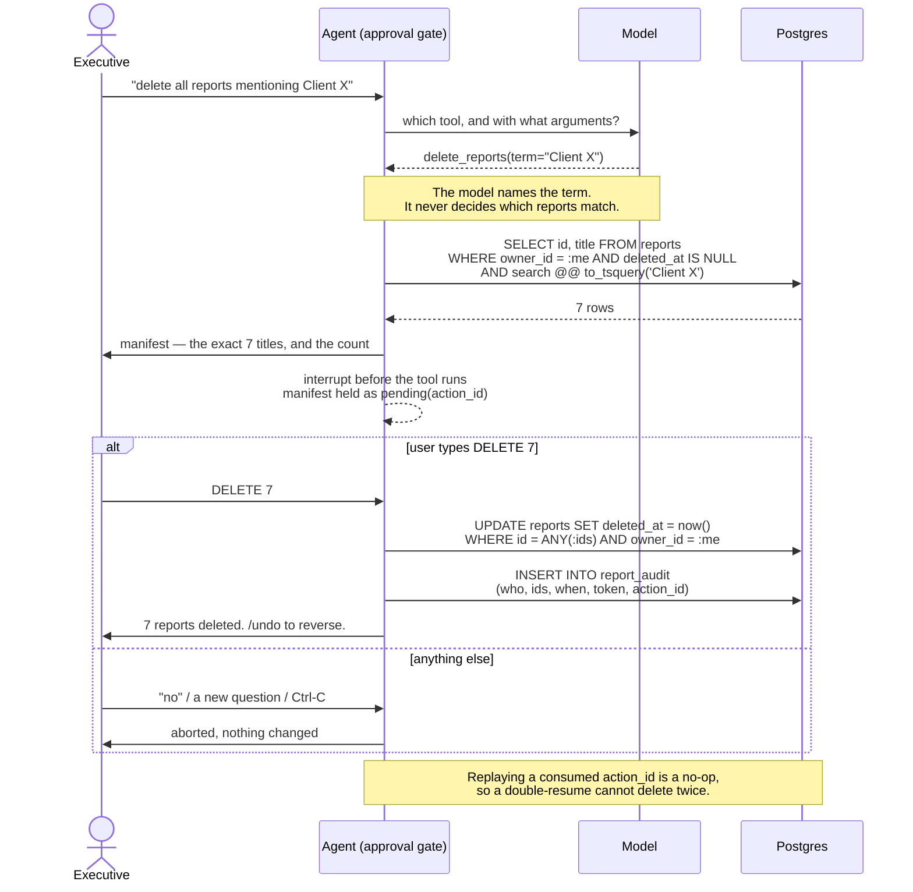

# Diagrams — the High-Level Design at a glance

Deliverable 1, in one place. Every diagram in this submission, with a line
saying what it shows and where the reasoning behind it lives. The HLD's prose —
services, components, layers and why each was chosen — is
[01-architecture.md](01-architecture.md).

---

## 1. System view

The whole target system. Colour marks what runs today, so the diagram doubles as
a statement of what the prototype implements rather than what it aspires to.
Services and the reasoning for each are in
[01-architecture.md](01-architecture.md#why-these-choices).

**Green** runs today · **amber** partly built · **dashed grey** designed, not built.

---

## 2. Agent hierarchy

Who delegates to whom, and — the part that matters — what each one can reach.
The system view above draws the agent as a single service because that is what
it is at the compute level: one process, one deployment. Inside it there are
three tiers, and the boundaries between them are where the safety properties
live.

Four properties are visible here and nowhere else:

**Only `run_sql` returns a warehouse row.** It is a tier-3 tool held by one
subagent, and masking is inside it, so there is exactly one path from BigQuery
into model context. `describe_schema` also touches BigQuery — the dotted edge —
but only for cached schema metadata; it executes no query and returns no rows,
which is why it can sit at tier 1 safely. The distinction is the one the test
enforces: it reads the source of every other tool and fails if any of them calls
`deps.source.execute`. Checked, rather than drawn.

**`report_writer` has no tools at all.** That is the whole mechanism preventing
an invented figure in a report: it can only write from the findings the analyst
passed it, because it has no way to look anything up.

**Destructive tools stay at tier 1.** `delete_reports` sits on the supervisor so
its approval interrupt fires at the top-level tool boundary, where the interface
can render a manifest and resume. An interrupt raised one `.invoke()` down is
not reachable by the CLI. The same is true of `ask_for_definitions`.

**Each tier bounds itself.** The analyst carries the query budget because it is
the loop that spends it; the supervisor carries the approval gate because it is
the boundary the interface can resume. Both are capped on model calls
independently, so a runaway subagent cannot spend the supervisor's allowance.

Adding a capability means adding a node at tier 1 — a plain function, or another
compiled agent behind a callable if it needs its own loop. `analyst`,
`report_writer` and `ask_about_report` are three instances of that one pattern,
so extensibility is demonstrated rather than promised.

---

## 3. One turn

The supervisor, its ten tools, the two points where a turn stops for a person,
and the analyst subagent's inner loop. Everything that constrains the model is a
middleware, a tool precondition or a SQL predicate — never an instruction in a
prompt. The middleware stack is tabulated in
[01-architecture.md](01-architecture.md#the-turn); the step-by-step
walkthrough is [02-data-flow.md](02-data-flow.md).

---

## 4. The Golden Bucket

Left: how analyst knowledge reaches a query at run time. Right: how the corpus
is kept current. Nothing flows from the agent into the corpus without passing
`human review`, and that edge is the whole safety argument for the learning
loop. Detail in
[03-requirements.md](03-requirements.md#1-hybrid-intelligence--the-golden-bucket).

---

## 5. The destructive-action gate

Deleting saved reports is the one destructive capability, and the ordering is
the safety property, so it is drawn as a sequence rather than a flow. The model
names the search term; it never decides which reports match. Detail in
[03-requirements.md](03-requirements.md#3-high-stakes-oversight-destructive-ops).

