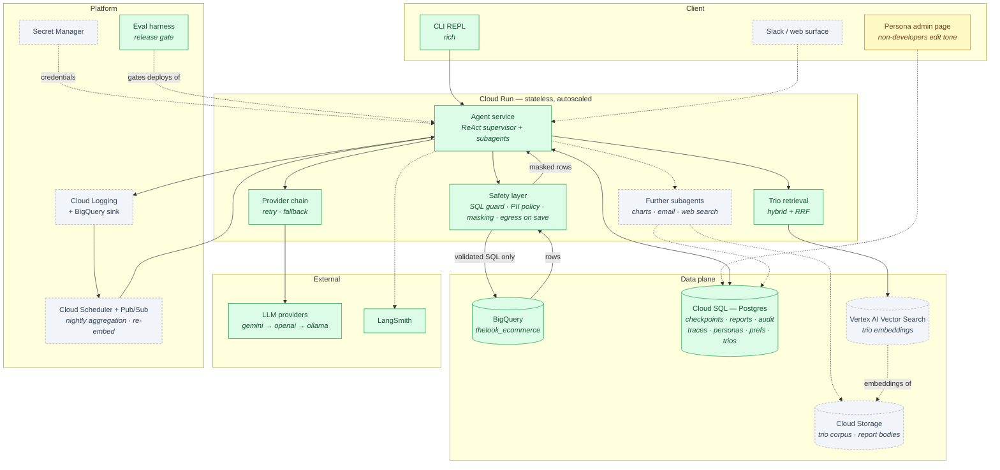
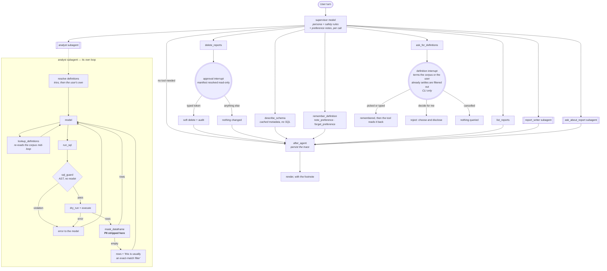

# 1. Architecture — the High-Level Design

The HLD proper: building blocks, services, compute and flow, with the reasoning
for every choice. The diagrams are reproduced in
[00-diagrams.md](00-diagrams.md) if you want them in one place.

Deliverable 1 (building blocks, services, compute, flow) and 2a (why these
choices).

## System view

The whole target system. Colour marks what runs today, so the diagram doubles as
a status report rather than an aspiration.

**Green** runs today · **amber** partly built · **dashed grey** designed, not built.

Everything inside Cloud Run is stateless. Conversation state lives in Postgres
through LangGraph's `PostgresSaver`, so any instance can serve any turn and a
restart mid-conversation loses nothing.

## Component inventory

| Component | Status | Where | Requirement |
|---|---|---|---|
| ReAct supervisor + middleware | **Built** | `agent/supervisor.py`, `agent/middleware.py` | all |
| Analyst, report-writer, report-reader subagents | **Built** | `agent/subagents.py` | all |
| Conversation summarization | **Built** | `agent/middleware.py` | resilience, cost |
| Column value conventions | **Built** | `knowledge/conventions.py` | hybrid intelligence |
| SQL guard (sqlglot AST) | **Built** | `safety/sql_guard.py` | safety |
| PII policy + masking | **Built** | `safety/pii.py`, `policies/thelook.yaml` | safety |
| Egress scan, on saved reports and the eval | **Built** | `safety/egress.py` | safety |
| BigQuery adapter, cost gate, value discovery | **Built** | `datasources/bigquery.py` | all |
| Query budget, repair, empty-result hint | **Built** | `agent/middleware.py`, `agent/tools.py` | resilience |
| Provider chain (retry + fallback middleware) | **Built** | `agent/middleware.py`, `llm/resilience.py` | resilience |
| Saved reports, audit trail, `/undo` | **Built** | `store/reports.py`, `agent/reports.py` | oversight |
| Confirmation gate | **Built** | `interrupt()` in `agent/reports.py` and `agent/memory.py` | oversight |
| Golden Bucket + hybrid retrieval | **Built** | `knowledge/` | hybrid intelligence |
| Preference notes | **Partial** | `store/preferences.py`, `agent/memory.py` | learning loop (user) |
| Traces, `/trace`, `/metrics` | **Built** | `obs/traces.py`, `agent/capture.py` | observability |
| Personas: versioned store, TTL cache, `/persona` | **Built** | `store/personas.py` | agility |
| Eval suite + release gate | **Built** | `evals/` | QA |
| Further capabilities as subagents | Designed | — | extensibility |
| Trace aggregation → improvement candidates | Designed | — | learning loop (system) |

## Layers

| Layer | Package | Responsibility |
|---|---|---|
| Interface | `cli/` | REPL, rendering, slash commands |
| Orchestration | `agent/` | The supervisor, its tools, its middleware |
| Data access | `datasources/` | `DataSource` protocol, BigQuery adapter |
| Safety | `safety/` | SQL guard, PII policy, masked frame, egress scan |
| Memory | `store/` | SQLAlchemy models + Alembic migrations |
| Knowledge | `knowledge/` | The Golden Bucket: trios, conventions, retrieval |
| Observability | `obs/` | Tracing, metrics, replay |
| LLM | `llm/` | Provider abstraction, content normalisation, error mapping |

Each layer is swappable without touching the others. The CLI could become a
Slack bot; BigQuery could become Snowflake by adding one adapter; the model
could become anything with a chat interface.

## The turn

One ReAct supervisor with ten tools, three of which are subagents. The model
decides *what* to ask; middleware and tool preconditions decide *what is
allowed*.

**The middleware stack.** This is where safety properties live — none of them is
an instruction in a prompt.

| Middleware | Stack | Configuration |
|---|---|---|
| `dynamic_prompt` | supervisor | persona body + safety rules + this user's preference notes, read per model call |
| `PIIMiddleware` ×3 | both | email, credit_card, ip; redact; `apply_to_tool_results` |
| `SummarizationMiddleware` | supervisor | trigger 30k tokens, keep 20 messages, a prompt that forbids restating figures |
| `ToolCallLimitMiddleware` | analyst | `run_sql`, capped at `max_analysis_steps + repair_budget + diagnose_budget` = 14 |
| `ModelCallLimitMiddleware` | both | `run_limit=30`, `exit_behavior="end"` |
| `ToolErrorMiddleware` | both | guard violations and warehouse errors returned to the model as tool results |
| `@after_agent` recorder | supervisor | persists the trace |

Two stacks, because the two agents bound different things. The query budget
belongs to the loop that spends it, so it sits on the analyst; the approval gate
belongs to the boundary the interface can resume, so it sits on the supervisor.

`SummarizationMiddleware` is placed *after* `PIIMiddleware`, and that ordering is
a guarantee rather than a preference. Both hook `before_model` and run in list
order; a summariser running first would read unredacted warehouse output and
write it back into state, turning a transient exposure into a stored one. Its
prompt also forbids restating figures — a summary that retypes `$412,880` gives
the next turn a number the model believes came from a query.

## Why these choices

**Cloud Run** because the workload is bursty, request-shaped, and scales to zero
between executives' questions. A GKE cluster is unjustified operational surface
for this.

**Cloud SQL (Postgres)** rather than a document store, because the access-control
properties are expressible as SQL predicates. Deleting reports by pattern is a
`WHERE ... @@ to_tsquery(...)`; ownership is a `WHERE owner_id = :current_user`.
Expressing those in Firestore means expressing them in application code — which
is exactly where a compromised model could bypass them.

**BigQuery** is fixed by the brief.

**Vertex AI Vector Search** for the Golden Bucket in production: the managed
option in the same project and region as everything else. The prototype uses
`pgvector` in the Postgres that already holds the trios — one store to run,
migrate and back up rather than two, and a trio and its embedding are written in
the same transaction so they cannot drift apart.

**Gemini, behind an abstraction.** `gemini-2.5-flash` is the right shape for this
workload: high-volume, mostly short completions, cost-sensitive, with enough
context to hold the schema DDL. But binding the system to one vendor makes
"resilient to third-party downtime" impossible to answer honestly. Provider
selection is one environment variable across four backends, and `LLM_FALLBACKS`
makes it a chain rather than a choice. Local Ollama is the floor — an offline
fallback needing no vendor at all.

**LangChain's `create_agent`, on LangGraph.** Worth saying plainly: this *is*
LangGraph. `create_agent` imports `StateGraph`, `ToolNode` and `Command` and
compiles a graph. The choice was never between two frameworks but between a
hand-built graph and the prebuilt one on the same runtime.

This project shipped the hand-built graph first — eighteen nodes, twelve node
files — on the argument that a prebuilt ReAct agent lets the model decide control
flow, so no safety property can be guaranteed. That argument was wrong, and where
it was wrong is the design:

> The guarantee never came from the edge. It comes from there being exactly one
> path from BigQuery into model context, with masking inside it.

In the graph that path was the `execute` node; here it is the `run_sql` tool.
Either way, what makes an email address unreachable is that no other code returns
a warehouse row — not the order in which nodes fire. Stated as an edge, the
property is only as good as the diagram staying true. Stated as *"one tool
touches the warehouse, and it masks"*, the property is checkable, and
`test_only_run_sql_reads_the_warehouse` checks it by reading the source of every
other tool.

Removing the router and planner also removed two real defects. `route_node`
spent a model call classifying every turn before anything ran — picking a tool is
that same classification, made by the same model, for free. `plan_node`
decomposed a question into a fixed list of steps that could not be revised after
seeing rows, so *"compare X and Y and explain why"* committed to its
decomposition before the first result came back. The analyst now issues a query,
reads the result, and decides what to ask next. Measured on the eval suite, the
change was worth **23 points** of execution accuracy.

**Storage: SQLAlchemy 2.0 with Alembic migrations.** Two properties matter more
than the ORM: migrations carry checksums and a tested `downgrade()`, and rows
bind to fields by name rather than position. Alembic is configured to ignore
LangGraph's `checkpoint_*` tables, which that library creates and migrates
itself.
